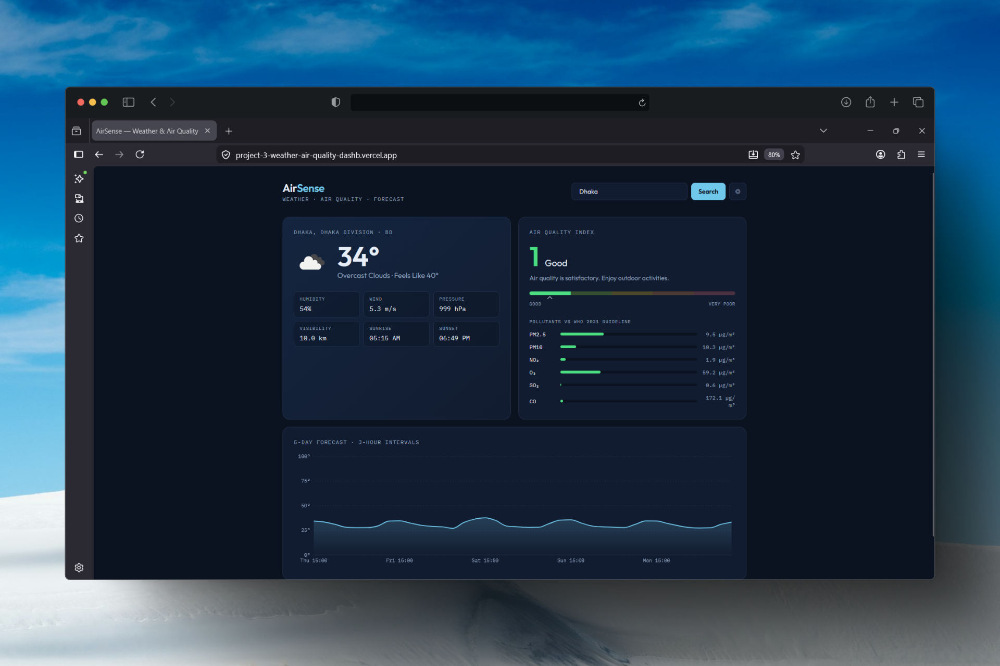

# AirSense — Weather & Air Quality Dashboard

A responsive dashboard that combines current weather, a 5-day temperature forecast, and real-time air quality data — including pollutant concentrations benchmarked against WHO 2021 guidelines.

> **Portfolio project 03 of 12** — demonstrates public REST API integration, parallel async data fetching, typed API layers, and chart-based data visualisation.

## Live Demo

🔗 [Live demo on Vercel](https://project-3-weather-air-quality-dashb.vercel.app/) <!-- TODO: add deployed URL -->

## Screenshot

<!-- TODO: add screenshot -->

**Home Page:**


**Different Location:**


## Features

- 🌍 City search with geocoding, plus one-click browser geolocation
- 🌤️ Current conditions: temperature, feels-like, humidity, wind, pressure, visibility, sunrise/sunset
- 🫁 Air Quality Index (1–5 scale) with a colour-coded spectrum gauge and health advice
- 📊 Six pollutants (PM2.5, PM10, NO₂, O₃, SO₂, CO) visualised against WHO 2021 24-hour guidelines
- 📈 5-day / 3-hour temperature forecast rendered with Recharts
- ⚡ Parallel API requests (`Promise.all`) for fast loads, with skeleton loading states
- 🛡️ Fully typed API layer — no `any` leaking into components

## Tech Stack

| Layer | Tools |
|---|---|
| Frontend | React 18, TypeScript, Vite |
| Styling | Tailwind CSS |
| Charts | Recharts |
| HTTP | Axios |
| Data | OpenWeatherMap (Geocoding, Current Weather, 5-Day Forecast, Air Pollution APIs) |
| Deployment | Vercel |

## Getting Started

### Prerequisites

- Node.js 18+
- A free [OpenWeatherMap API key](https://openweathermap.org/api)

### Setup

```bash
# 1. Clone the repository
git clone https://github.com/jinx71/weather-aq-dashboard.git
cd weather-aq-dashboard

# 2. Install dependencies
npm install

# 3. Configure environment variables
cp .env.example .env
# then paste your OpenWeatherMap key into .env

# 4. Run the dev server
npm run dev
```

The app starts at `http://localhost:5173` and loads Dublin by default.

### Build

```bash
npm run build
npm run preview
```

## Architecture Notes

- **`src/services/weatherApi.ts`** — single typed API layer; raw OWM responses are mapped to domain types at the boundary so components never touch external response shapes.
- **`src/hooks/useWeatherDashboard.ts`** — one hook owns all loading/error/data state; the three independent API calls run in parallel via `Promise.all`.
- **`src/utils/aqi.ts`** — AQI scale metadata and WHO pollutant guidelines live in one place, keeping health logic out of UI components.

## Environment Variables

| Variable | Description |
|---|---|
| `VITE_OWM_API_KEY` | OpenWeatherMap API key (free tier is sufficient) |

> ⚠️ `VITE_`-prefixed variables are embedded in the client bundle. This is acceptable for a free-tier demo key with domain restrictions; production apps should proxy requests through a backend.

## License

MIT
